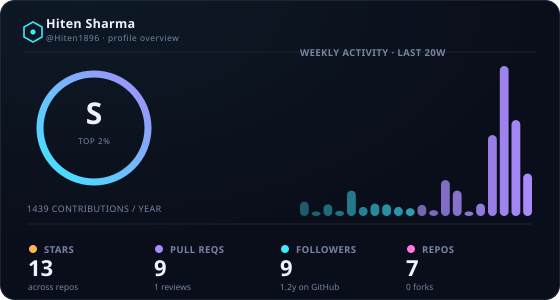
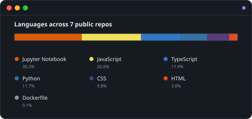
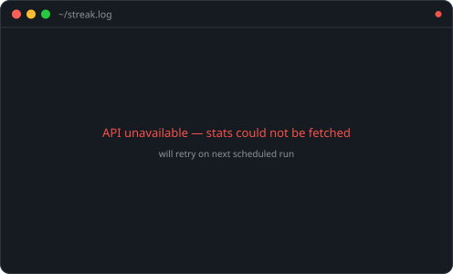

  <!-- Capsule Render Wave Banner -->
  

   

  <!-- Badges -->
  

     
     
    
  

  

    
    
    
  

---

## 👤 About Me

  
    Hi, I'm <strong>Hiten Sharma</strong>, a Computer Science Engineering undergraduate specializing in Artificial Intelligence & Machine Learning (B.Tech CSE - AIML).
  

---
### 🧰 Tech Stack & Tools

  <b>Languages & Shell:</b> 
  
  
  
  
  
    
  
  <b>AI, ML & Libraries:</b> 
  
  
  
  
  
  
  
  
    

  <b>Cloud, Deployment & Tools:</b> 
  
  
  
  
  
  
  
  

---

### 🚀 Featured Projects

<b>🛡️ TrustGuard Pro – Digital Forensics Suite</b>

 

A digital forensics suite built with React and Firebase designed to detect AI-generated media (Deepfakes) and analyze metadata manipulation.

| Stack | Scale | Performance | Security | Impact | Repository |
| :--- | :--- | :--- | :--- | :--- | :--- |
| React.js, Firebase, Vercel | Web Application | Optimized client-side processing | Client & Firebase Auth Rules | Media Authenticity Verification | [Hiten1896/TrustGuard](https://github.com/Hiten1896) |

*   **Engineering Highlights:**
    *   Designed modular file processing pipelines for metadata Extraction and Deepfake detection.
    *   Integrated Firebase backend for authentication, secure storage, and real-time logs.
    *   Deployed production build on Vercel for continuous deployment.

<b>🎬 Movie Hunt – Streaming & Movie Tracking App</b>

 

A sleek web application for movie searching, tracking streaming availability, and aggregating IMDb data.

| Stack | Scale | Performance | Security | Impact | Repository |
| :--- | :--- | :--- | :--- | :--- | :--- |
| JavaScript, TMDB API, HTML5/CSS3 | Single Page Web App | Async API fetching with minimal latency | Encrypted environment API keys | Simplified discovery for users | [Hiten1896/Movie-Hunt](https://github.com/Hiten1896) |

*   **Engineering Highlights:**
    *   Leveraged TMDB API for real-time movie queries and streaming availability data.
    *   Built custom responsive UI layouts with dynamic data rendering.

---

## 📊 GitHub Analytics

  
  

  

---

### 🗓 Contribution Activity 

  

---
